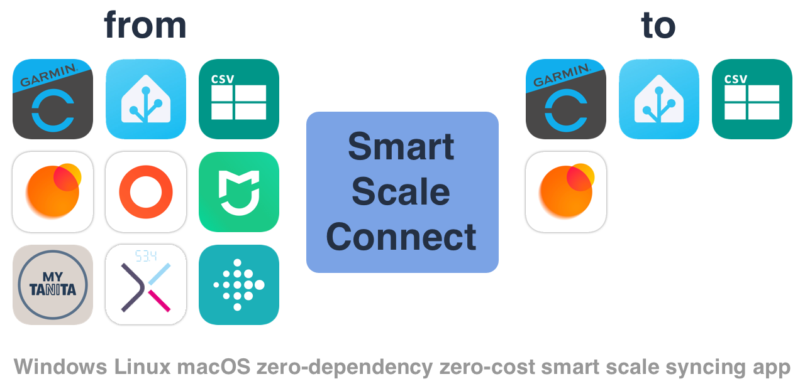
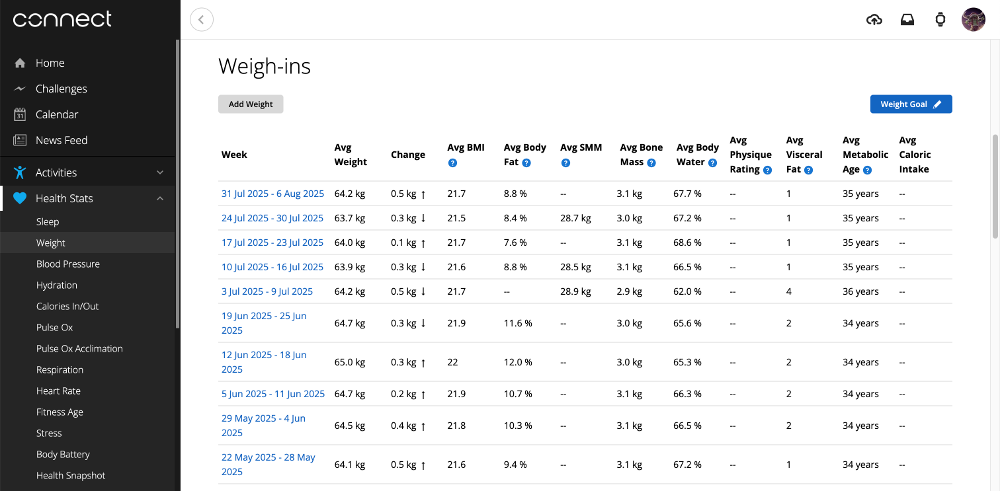
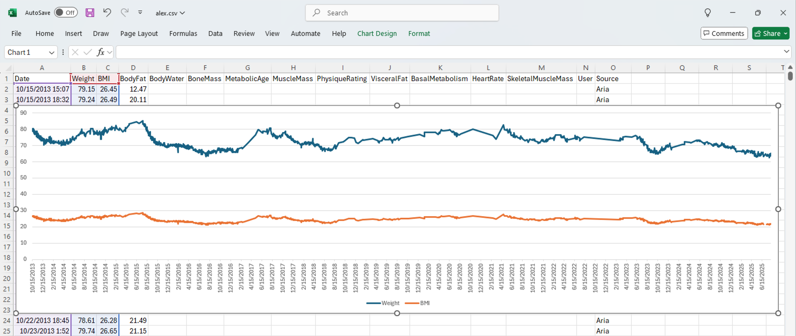

Application for synchronizing smart scale data between different ecosystems.

**Features:**

- Load data from [Garmin], [Home Assistant], [Mi Fitness], [My TANITA], [Picooc], [Xiaomi Home], [Zepp Life], [CSV], [JSON]
- Save data to [Garmin], [Home Assistant], [Zepp Life], [CSV], [JSON]
- Support params: `Weight`, `BMI`, `Body Fat`, `Body Water`, `Bone Mass`, `Metabolic Age`, `Muscle Mass`, `Physique Rating`, `ProteinMass`, `Visceral Fat`, `Basal Metabolism`, `Heart Rate`, `Skeletal Muscle Mass`
- Support multiple users data
- Support scripting language 

[Garmin]: https://connect.garmin.com/
[Garmin Connect]: https://connect.garmin.com/
[Home Assistant]: https://www.home-assistant.io/
[Mi Fitness]: https://play.google.com/store/apps/details?id=com.xiaomi.wearable
[My TANITA]: https://mytanita.eu/
[Picooc]: https://play.google.com/store/apps/details?id=com.picooc.international
[Xiaomi Home]: https://play.google.com/store/apps/details?id=com.xiaomi.smarthome
[Zepp Life]: https://play.google.com/store/apps/details?id=com.xiaomi.hm.health
[CSV]: https://en.wikipedia.org/wiki/Comma-separated_values
[JSON]: https://en.wikipedia.org/wiki/JSON

**Inspired by:** series of projects from [@lswiderski](https://github.com/lswiderski).

**Attention.** The application is at an early stage of development. The configuration and functionality can change a lot.

---

<!-- TOC -->
  * [Fast start](#fast-start)
  * [Configuration](#configuration)
    * [To: Garmin](#to-garmin)
    * [From: Garmin](#from-garmin)
    * [From: Xiaomi](#from-xiaomi)
    * [From: Mi Fitness](#from-mi-fitness)
    * [From: Xiaomi Home](#from-xiaomi-home)
    * [From: Zepp Life](#from-zepp-life)
    * [To: Zepp Life](#to-zepp-life)
    * [From: My TANINA](#from-my-tanina)
    * [From: Picooc](#from-picooc)
    * [From: Fitbit](#from-fitbit)
    * [From/to: CSV](#fromto-csv)
    * [From/to: JSON](#fromto-json)
    * [From: YAML](#from-yaml)
    * [From: Home Assistant](#from-home-assistant)
    * [To: Home Assistant](#to-home-assistant)
  * [Command line (CLI)](#command-line-cli)
  * [Sync logic](#sync-logic)
  * [Scripting language](#scripting-language)
  * [Known Scales](#known-scales)
  * [Useful links](#useful-links)
<!-- TOC -->

## Fast start

- Download binary for your OS from [latest release](https://github.com/AlexxIT/SmartScaleConnect/releases/).
- Or use the Docker [container](https://hub.docker.com/r/alexxit/smartscaleconnect).
- Or add Home Assistant [add-on](https://my.home-assistant.io/redirect/supervisor_addon/?addon=a889bffc_scaleconnect&repository_url=https%3A%2F%2Fgithub.com%2FAlexxIT%2Fhassio-addons).

## Configuration

A configuration file with name `scaleconnect.yaml` may be located in the current working directory or near application binary.

The [YAML](https://en.wikipedia.org/wiki/YAML) format is very demanding on indentation and spaces. Please observe them.

After the first launch, the `scaleconnect.json` file may appear next to the configuration file. It contains the authorization credentials for your services.

Config file example:

```yaml
sync_alex_fitbit:
  from: fitbit AlexMyFitbitData.zip
  to: garmin alex@gmail.com garmin-password

sync_alex_zepp:
  from: zepp/xiaomi alex@gmail.com xiaomi-password
  to: garmin alex@gmail.com garmin-password
  expr:
    Weight: 'BodyFat == 0 || Date >= date("2024-11-25") ? 0 : Weight'

sync_alex_mifitness:
  from: mifitness alex@gmail.com xiaomi-password
  to: garmin alex@gmail.com garmin-password
  expr:
    Weight: 'BodyFat == 0 ? 0 : Weight'
    BodyFat: 'Date >= date("2025-04-01") && Source == "blt.3.1abcdefabcd00" ? 0 : BodyFat'
```

### To: Garmin



**Limitations:**

- Currently, two-factor authentication is not supported.
- Currently, China server is not supported.

**Example.** Upload data go [Garmin Connect] from [CSV]:

```yaml
sync_garmin:
  from: csv alex_garmin.csv
  to: garmin {username} {password}
```

If you want to upload custom manual data to Garmin, just import it from CSV file.

### From: Garmin

**Example.** Download data from [Garmin Connect] to [CSV]:

```yaml
sync_garmin:
  from: garmin {username} {password}
  to: csv alex_garmin.csv
```

### From: Xiaomi

Xiaomi scales, depending on the model, are supported in different applications - [Mi Fitness], [Xiaomi Home], [Zepp Life].

**Mi Body Composition Scale 2** (`XMTZC05HM`)

- Supported in the **Zepp Life** app
  - Get user data: `from: zepp/xiaomi alex@gmail.com xiaomi-password`
  - Get other user data: `from: zepp/xiaomi alex@gmail.com xiaomi-password Yulia`

**Mi Body Composition Scale S400 CN** (`MJTZC01YM`, `yunmai.scales.ms103`)

- **China version**
- Supported in the **Mi Fitness** app in China region
  - Get user data: `from: mifitness alex@gmail.com xiaomi-password`
  - Get scale data: `from: mifitness alex@gmail.com xiaomi-password yunmai.scales.ms103`
- Supported in the **Mi Fitness** app in Euro region (ONLY via [Vevs mod](https://rumihome.ru/prilozheniya/mihome-vevs))
  - Get user data: `from: mifitness alex@gmail.com ru`
  - Get scale data: `from: mifitness alex@gmail.com xiaomi-password yunmai.scales.ms103`
- Supported in the **Xiaomi Home** app
  - Get scale data: `from: xiaomihome alex@gmail.com xiaomi-password cn yunmai.scales.ms103`

**Mi Body Composition Scale S400 EU** (`MJTZC01YM`, `yunmai.scales.ms104`)

- **Euro version**
- Not supported in the **Mi Fitness** app
- Supported in the **Xiaomi Home** app in Euro region
  - Get scale data: `from: xiaomihome alex@gmail.com xiaomi-password ru yunmai.scales.ms104`

**Xiaomi 8-Electrode Body Composition Scale CN** (`XMTZC01YM`, `yunmai.scales.ms3001`)

- **China version**
- Supported in the **Mi Fitness** app
  - Get user data: `from: mifitness alex@gmail.com xiaomi-password`
- Not supported in the **Xiaomi Home** app

### From: Mi Fitness

Tested on scales:

- **Mi Body Composition Scale S400 CN** (`MJTZC01YM`, `yunmai.scales.ms103`) - getting other users data is supported.
- **Xiaomi 8-Electrode Body Composition Scale CN** (`XMTZC01YM`, `yunmai.scales.ms3001`) - getting other users data is not supported yet.

**Example.** Get data from all scales of the main user (China region):

```yaml
sync_mifitness:
  from: mifitness {username} {password}
  to: csv alex_mifitness.csv
```

**Example.** Get data from all scales of the main user (other region):

- `de` (Europe)
- `i2` (India)
- `ru` (Russia)
- `sg` (Singapore)
- `us` (United States)

```yaml
sync_mifitness:
  from: mifitness {username} {password} {region}
  to: csv alex_mifitness_region.csv
```

**Example.** Get the data of all users from specific scales:

```yaml
sync_mifitness:
  from: mifitness {username} {password} {scales model}
  to: csv all_users_mifitness.csv
```

- You can check scales model name from Mi Fitness app > Device > Scale > About device > Device model.
- You can add a filter by username.

**Example:**

```yaml
sync_yulia_mifitness:
  from: mifitness alex@gmail.com xiaomi-password yunmai.scales.ms103
  to: csv yulia_mifitness.csv
  expr:
    Weight: 'User == "Yulia" ? Weight : 0'
```

### From: Xiaomi Home

Tested on scales:

- **Mi Body Composition Scale S400 EU** (`MJTZC01YM`, `yunmai.scales.ms104`) - getting other users data is supported.

**Example.** Get the data of all users from specific scales and region:

- `de` (Europe)
- `i2` (India)
- `ru` (Russia)
- `sg` (Singapore)
- `us` (United States)

```yaml
sync_xiaomihome:
  from: xiaomihome {username} {password} {region} {scales model}
  to: csv all_users_xiaomihome.csv
```

**Example:**

```yaml
sync_yulia_xiaomihome:
  from: xiaomihome alex@gmail.com xiaomi-password ru yunmai.scales.ms104
  to: csv yulia_xiaomihome.csv
  expr:
    Weight: 'User == "Yulia" ? Weight : 0'
```

### From: Zepp Life

**Limitations:**

- Currently, only login via a Xiaomi account is supported.
- When syncing, you are logged out of the mobile app. It is not known how this problem can be fixed.

Tested on scales:

- Mi Body Composition Scale 2 (XMTZC05HM)

**Example.** Get data from all scales of the main user:

```yaml
sync_zepp:
  from: zepp/xiaomi {username} {password}
  to: csv alex_zepp.csv
```

**Example.** Getting data from all scales of the selected user:

```yaml
sync_zepp:
  from: zepp/xiaomi {username} {password} {user}
  to: csv alex_zepp.csv
```

### To: Zepp Life

You can upload data to [Zepp Life].

**Important.** Your data must have `Weight`, `BodyFat`, `BodyScore` and `Height`, so it will be displayed in advanced view. Otherwise, it will only be displayed as `Weight` data.

**Example.** Send data to Zepp Life from config file:

```yaml
sync_zepp:
  from:
    Weight: 64.30
    BodyFat: 10.0
    BodyScore: 85
    Height: 172
  to: zepp/xiaomi {username} {password}
```

### From: My TANINA

On Tanita servers, the weighing time is stored with an unknown time zone and may be incorrect.

```yaml
sync_tanita:
  from: tanita {username} {password}
  to: csv alex_tanita.csv
```

### From: Picooc

**Example.** Get data from all scales of the main user:

```yaml
sync_picooc:
  from: picooc {username} {password}
  to: csv alex_picooc.csv
```

**Example.** Getting data from all scales of the selected user:

```yaml
sync_picooc:
  from: picooc {username} {password} {user}
  to: csv alex_picooc.csv
```

### From: Fitbit

My Fitbit Aria scales are no longer working. Therefore, I am interested in this service only from the point of view of archived data.

Google bought this service and sent an email with the subject "Take action by February 2, 2026 to keep using Fitbit". There they offer to [download all the data](https://www.fitbit.com/settings/data/export), otherwise it will disappear.

**Example.** Retrieving data from the archive:

```yaml
sync_fitbit:
  from: fitbit MyFitbitData.zip
  to: csv alex_fitbit.csv
```

### From/to: CSV



A good format for human-readable text. The time inside the file is always your local time. Well-supported in MS Office. It is convenient to build quick analytics there.

You can use [CSV] **file** or **HTTP-link** as source and CSV **file**, **HTTP-link** or **stdout** as destination:

```yaml
sync_from_file:
  from: csv source.csv

sync_from_http:
  from: csv http://192.168.1.123/source.csv
  
sync_to_file:
  to: csv destination.csv

sync_to_http:
  to: csv http://192.168.1.123:8123/api/webhook/594b7e73-1f0f-4c3c-aded-eeaee78a6790

sync_to_stdout:
  to: csv stdout
```

From link will be downloaded with GET request. To link will be uploaded with POST request.

### From/to: JSON

Same as [CSV], but [JSON] file or HTTP-link as source and CSV file or HTTP-link as destination.

### From: YAML

You can pass weighting data to config in raw YAML form. This is useful when integrating with other software, such as Home Assistant.

```yaml
sync_one_yaml:
  from:
    Weight: 65.0
    BMI: 21.0
    BodyFat: 10.0
  to: garmin {username} {password}

sync_many_yaml:
  from:
    - Data: '2025-08-01T09:00:00Z'
      Weight: 65.0
    - Data: '2025-08-02T09:00:00Z'
      Weight: 66.0
  to: zepp/xiaomi {username} {password}
```

### From: Home Assistant

**Home Assistant Add-on**

You can call `hassio.addon_stdin` service and pass **scaleconnect** config as `input`. Remember that the names of the synchronization instructions are located at the top level of the configuration. There may be one or more such instructions.

```yaml
action: hassio.addon_stdin
data:
  addon: a889bffc_scaleconnect  # addon ID
  input:
    sync_garmin:  # sync name (use any)
      from:
        Weight: '{{ states("sensor.mi_body_composition_scale_mass")|float }}'  # you can use templates
        BMI: 21.0
        BodyFat: 10.0
      to: garmin {username} {password}
```

**Docker or venv**

You need to download the binary file for your OS yourself, put it in the `/config` folder and give it the launch rights (`chmod +x scaleconnect`). Then write automation:

```yaml
shell_command:
  scale_sync: >-
    /config/scaleconnect -c '{{ {
      "sync_garmin": {
        "from": {
          "Weight": states("sensor.mi_body_composition_scale_mass")|float,
        },
        "to": "garmin {username} {password}"
      }
    }|tojson }}'
```

### To: Home Assistant

Each sync, the most recent weighing will be uploaded to the Home Assistant.

Modify the example as you like. Add the other parameters of your scales. The data will be saved during HA reboots. Graphs will remember the history of changes.

Add to your **configuration.yaml**:

```yaml
input_number:
  alex_weight:
    name: Alex Weight
    min: 50
    max: 80
    unit_of_measurement: kg
    icon: mdi:weight
  alex_bmi:
    name: Alex BMI
    min: 15
    max: 30
```

Add automation:

```yaml
alias: Weight Data
triggers:
  - trigger: webhook
    allowed_methods: [ POST ]
    local_only: true
    webhook_id: "594b7e73-1f0f-4c3c-aded-eeaee78a6790"  # change to random
conditions: []
actions:
  - action: persistent_notification.create
    data:
      message: "{{ trigger.json }}"  # only for tests
  - action: input_number.set_value
    data:
      value: "{{ trigger.json.Weight|round(2) }}"
    target:
      entity_id: input_number.alex_weight  # change here
  - action: input_number.set_value
    data:
      value: "{{ trigger.json.BMI|round(2) }}"
    target:
      entity_id: input_number.alex_bmi  # change here
mode: single
```

Add to `scaleconnect.yaml`:

```yaml
sync_hass:
  from: mifitness alex@gmail.com xiaomi-password
  to: json/latest http://192.168.1.123:8123/api/webhook/594b7e73-1f0f-4c3c-aded-eeaee78a6790
```

## Command line (CLI)

**Options:**

- `-c {path to config file}` or `-c {raw config in YAML/JSON format}` - Config file path or content.
- `-r {duration}` - Repeat config file processing after timeout (format: `2h0m0s`).
- `-i` - "interactive mode" for receiving config file content in YAML/JSON format via `stdin` (single line with `\n` at the end).

**Example.** Send config content from command line and receive response to `stdout`:

```shell
./scaleconnect -c '{"sync1":{"from":"garmin alex@gmail.com garmin-password","to":"json stdout"}}'
```

By running the app in "interactive mode", you can send commands to it via `stdin` and receive responses in `stdout`.

## Sync logic

Every time you start the app, the weight data is fully synchronized:

- All the source data for the entire time is loaded.
- All destination data for the entire time is loaded.
- If the timestamp completely matches, the data is considered the same.
  - If all other parameters match, the weighting **is skipped**.
  - If the other parameters are different, the weighting is **completely replaced** by the new data.
  - If the `Weight` column is zero, the destination weighting **is deleted**.
- If the timestamp does not match, the weighing **is uploaded** to the service.
- If the `Weight` column has zero, the weighting **is skipped**.

At the first start, I recommend downloading all your data from all services to CSV file and analyze it in Excel for some incorrect data.

If you need to delete a lot of incorrect data from Garmin, you can download it to CSV file, put zeros in the `Weight` column, and then upload this CSV file to Garmin again.

## Scripting language

You can change the synchronization behavior and change the weighting values using the powerful scripting language - [expr](https://expr-lang.org/).

```yaml
sync_expr:
  expr:
    Date: 'Date - duration("1h")'             # string RFC 3339, you can adjust the weighing time
    Weight: 'Weight > 60 ? 0 : Weight'        # float kg, you can use conditions
    BMI: 'BMI * 0.95'                         # float index, mathematical formulas can be used
    BodyFat: 'BodyFat - 5.0'                  # float percent, mathematical formulas can be used
    BodyWater: 'BodyWater'                    # float percent
    BoneMass: 'BoneMass'                      # float kg
    MetabolicAge: 'MetabolicAge'              # int years
    MuscleMass: 'MuscleMass'                  # float kg
    PhysiqueRating: 'PhysiqueRating'          # int index, from 1 to 9
    ProteinMass: 'ProteinMass'                # float kg
    VisceralFat: 'VisceralFat'                # int index, from 1 to 59
    BasalMetabolism: 'BasalMetabolism'        # int kcal
    BodyScore: 'BodyScore'                    # int index, from 1 to 100
    HeartRate: 'HeartRate'                    # int bpm
    Height: 'Height'                          # float cm
    SkeletalMuscleMass: 'SkeletalMuscleMass'  # float kg
    User: 'User'                              # string
    Source: 'Source + " some other text"'     # string, adding custom text information
```

For example, many scales measure the `MuscleMass` parameter. Although professional scales, including Garmin, measure `SkeletalMuscleMass`. If you want the `MuscleMass` parameter to be displayed in Garmin instead of `SkeletalMuscleMass`, do this:

```yaml
sync_expr:
  expr:
    SkeletalMuscleMass: 'MuscleMass'  # replace the skeletal mass data with a regular mass
```

For example, I bought a new scale from Xiaomi and don't want to sync data from the Zepp after a certain date. And also I don't want to synchronize data without fat information (incorrect weighings):

```yaml
sync_alex_zepp:
  expr:
    Weight: 'BodyFat == 0 || Date >= date("2024-11-25") ? 0 : Weight'
```

Or I bought a new **Xiaomi 8-Electrode Scale** in addition to the old one **Xiaomi S400**. Now the S400 shows a completely wrong fat percentage. But I want to leave the weights from ols scales because they have **skeletal muscle mass** data, and the new scales don't have this param. Also, I want to ignore weighing without fat information.

```yaml
sync_alex_mifitness:
  expr:
    Weight: 'BodyFat == 0 ? 0 : Weight'  # ignore weighing without fat information
    BodyFat: 'Date >= date("2025-04-01") && Source == "blt.3.1abcdefabcd00" ? 0 : BodyFat'  # zero body fat from old scales
```

## Known Scales

| Scale                                                 | Price | Application    | Sync         | Comment                 |
|-------------------------------------------------------|-------|----------------|--------------|-------------------------|
| Garmin Index S2 Smart Scale (010-02294-02)            | $200  | Garmin Connect | Wi-Fi        | Simple impedance        |
| Fitbit Aria Air Smart Scale (FB203WT)                 | $50   | Fitbit         | Wi-Fi        | Simple impedance        |
| Mi Smart Scale 2                                      | $20   | Zepp Life      | Mobile Phone | No impedance            |
| Mi Body Composition Scale 2 (XMTZC05HM)               | $30   | Zepp Life      | Mobile Phone | Simple impedance        |
| Mi Body Composition Scale S400 (MJTZC01YM)            | $30   | Xiaomi Home    | BLE Gateway  | Dual-frequncy impedance |
| Xiaomi 8-Electrode Body Composition Scale (XMTZC01YM) | $65   | Mi Fitness     | Wi-Fi        | 8-Electrode impedance   |

## Useful links

- https://github.com/lswiderski/WebBodyComposition
